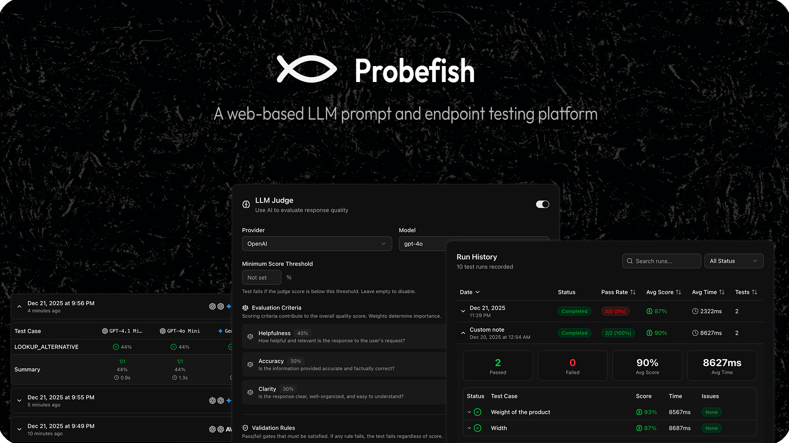

A web-based LLM prompt and endpoint testing platform. Organize, version, test, and validate Large Language Model prompts and HTTP endpoints through comprehensive test suites with static validation rules and LLM-based judge evaluation.

## Acknowledgments

This project is developed and maintained with support from [](https://www.gomage.com/)

## Tech Stack

- **Frontend**: Next.js 16, React 19, TypeScript
- **Backend**: Next.js API Routes
- **Database**: MongoDB with Mongoose
- **UI**: Radix UI + Tailwind CSS
- **Authentication**: JWT-based sessions
- **LLM Providers**: OpenAI, Anthropic, Google Gemini

## Features

### Authentication & Organizations

- User registration and login with JWT sessions
- Organization-based multi-tenancy with role-based access control
- Member roles: owner, admin, member, viewer
- Invitation system with expiring tokens
- Super admin functionality for user management

### Project Management

- Create and organize projects with folder hierarchy
- Project visibility (public/private)
- Project-level member management with roles (viewer, editor, admin)
- Projects contain prompts, endpoints, and test suites

### Prompt Management

- Create and version prompts with full version history
- System and user prompts with variable substitution (`{{variable}}` syntax)
- Model configuration per version:
  - Provider: OpenAI, Anthropic, Gemini, custom
  - Models: GPT-5/4.1/4o series, Claude 4.5/4 series, Gemini 3/2.5 series
  - Parameters: temperature, maxTokens, topP, frequencyPenalty, presencePenalty

### Endpoint Management

- Configure HTTP endpoints (GET, POST, PUT, PATCH, DELETE)
- Authentication: None, Bearer token, API key, Basic auth
- Custom headers and body templates with variables
- Response content extraction via JSON path
- Built-in endpoint testing

See [Endpoint Testing Guide](_docs/endpoint-testing.md) for detailed instructions.

### Test Suites

- Create test suites targeting prompts or endpoints
- **Test Cases**: Define input variables and expected outputs
- Duplicate test cases for quick variations
- Pin suites to specific prompt versions

### Static Validation Rules

Deterministic checks that run on every response without LLM calls:

| Rule Type | Description |
|-----------|-------------|
| **Contains** | Response must contain specified text |
| **Excludes** | Response must not contain specified text |
| **Min Length** | Response must be at least N characters |
| **Max Length** | Response must not exceed N characters |
| **Regex** | Response must match a regular expression pattern |
| **JSON Schema** | Response must validate against a JSON schema |
| **Max Response Time** | Response must complete within N milliseconds |

Each rule has a **severity level**:
- **Fail**: Test fails if rule is not satisfied
- **Warning**: Test passes but shows a warning

### LLM Judge Evaluation

AI-powered evaluation using an LLM to assess response quality. The judge uses a separate LLM call to evaluate outputs.

#### Scoring Criteria

Define weighted criteria for multi-dimensional scoring:

```
Example:
- Helpfulness (40%) - How helpful is the response?
- Accuracy (30%) - Is the information correct?
- Clarity (30%) - Is it well-organized and clear?
```

The judge scores each criterion 0-100 and computes a weighted average. Criteria weights should sum to 100%.

#### Judge Validation Rules

Pass/fail gates evaluated by the LLM judge:

| Severity | Behavior |
|----------|----------|
| **Fail** | Test fails if the judge determines the rule is not satisfied |
| **Warning** | Test passes but displays a warning |

Example rules:
- "Response must not contain harmful content"
- "Response must include a disclaimer"
- "Response must be in a professional tone"

The judge provides reasoning for each validation decision.

#### Judge Configuration

- **Provider**: OpenAI, Anthropic, or Gemini
- **Model**: Select the model for evaluation (e.g., gpt-4o-mini, claude-haiku-4-5, gemini-2.5-flash)
- **Minimum Score Threshold**: Optional minimum score (0-100) that must be met for the test to pass

### Test Results

- Execute test suites with real LLM/HTTP calls
- Track response times
- View validation results and judge scores
- Test run history with statistics
- Dashboard with pass rates and suite summaries
- **Test Run Comparison**: Compare two test runs to identify regressions, improvements, and unchanged results
- **Project-Level Comparison**: Compare all suites across two dates to see overall quality trends

### Webhooks

Receive notifications when test events occur:

| Event | Description |
|-------|-------------|
| **test.run.completed** | Triggered when any test run completes |
| **test.run.failed** | Triggered when a test run has failures |
| **test.regression.detected** | Triggered when test results regress from previous run |

Features:
- **HMAC Signature Verification**: Secure webhook payloads with SHA-256 signatures
- **Automatic Retries**: Configurable retry count with exponential backoff
- **Filters**: Trigger only on specific suites, failures, or regressions
- **Delivery History**: Track webhook delivery success/failure
- **Test Delivery**: Send test payloads to verify webhook configuration

### Organization Settings

- API key management for LLM providers (encrypted storage)
- Key rotation capability
- Member and invitation management

### API Access & CI/CD Integration

- Personal Access Tokens for programmatic API access
- Scoped permissions for fine-grained access control
- Export test results in JUnit XML, JSON, or CSV formats
- Run tests via API for CI/CD pipeline integration
- Built-in CI/CD configuration generator (Project Settings → CI/CD)

See [API Authentication Guide](_docs/api-authentication.md) for detailed documentation on CI/CD integration with GitLab CI, GitHub Actions, and Jenkins.

## Getting Started

### Prerequisites

- Node.js 18+
- MongoDB instance
- API keys for LLM providers (OpenAI, Anthropic, and/or Gemini)

### Installation

```bash
npm install
```

### Environment Variables

Create a `.env.local` file:

```env
MONGODB_URI=mongodb://localhost:27017/probefish
JWT_SECRET=your-jwt-secret
ENCRYPTION_KEY=your-32-byte-encryption-key
```

### Development

```bash
npm run dev
```

Open [http://localhost:3000](http://localhost:3000)

### Build

```bash
npm run build
npm start
```

## License

Apache License 2.0 - see [LICENSE](LICENSE) for details.
